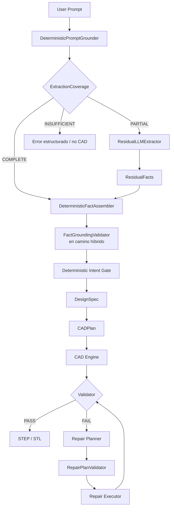

<p align="center">
  <a href="./README.md">🇬🇧 English</a> · <strong>🇪🇸 Español</strong>
</p>

<h1 align="center">CAD AI</h1>

<p align="center">
  <a href="https://github.com/Evo1148/CAD-AI/actions/workflows/ci.yml">
    
  </a>
</p>

<p align="center">
  Un sistema local-first para transformar requisitos en lenguaje natural en
  <strong>CAD paramétrico validado</strong> mediante grounding determinista,
  planificación estructurada y reparación automática controlada.
</p>

<p align="center">
  <strong>Lenguaje natural → hechos grounded → DesignSpec → CADPlan → geometría → validación → reparación → STEP/STL</strong>
</p>

---

## Descripción

CAD AI explora una idea sencilla: un LLM puede ayudar a interpretar la intención de diseño, pero **no debe ser la autoridad que crea o aprueba directamente la geometría**.

Por eso el sistema separa interpretación, autorización, ejecución y validación.

Los requisitos en lenguaje natural se convierten en hechos estructurados, pasan por gates deterministas, se transforman en una especificación formal y un plan CAD, se ejecutan mediante un motor paramétrico y son comprobados por un validador independiente. Si la validación falla, un bucle de reparación restringido puede proponer una corrección sin entregar al LLM control libre sobre la geometría.

> **Estado:** desarrollo activo. El código público incluye actualmente **CAD AI V0.2**, Capability Packs 1–3, Prototype Usability Gate, LAB-001, tooling de benchmark y la suite automatizada de tests.

## Arquitectura de un vistazo



La frontera arquitectónica es deliberada: **los modelos pueden interpretar o proponer, mientras que los componentes deterministas autorizan, ejecutan y validan**.

## Código

- 🧠 [Paquete principal](./src/cad_ai/)
- 🧪 [Tests](./tests/)
- 📐 [Capability layer V0.2](./src/cad_ai/capability_v02.py)
- 🧭 [Prompt grounding](./src/cad_ai/prompt_grounding.py)
- 🚪 [Prototype Usability Gate](./src/cad_ai/prototype_gate.py)
- 🔬 [LAB runner](./src/cad_ai/lab.py)
- 📊 [Benchmark tooling](./src/cad_ai/benchmark/)
- 🏗️ [Arquitectura](./docs/architecture.md)
- 🧱 [Principios de ingeniería](./docs/principles.md)
- 📜 [Historial de desarrollo](./docs/development-history.es.md)

## Pipeline principal

```text
User Prompt
    │
    ▼
DeterministicPromptGrounder
    │
    ▼
ExtractionCoverage
    │
    ├── COMPLETE ─────────► DeterministicFactAssembler
    │
    ├── PARTIAL ──────────► ResidualLLMExtractor
    │                           │
    │                           ▼
    │                      ResidualFacts
    │                           │
    │                           ▼
    │                  DeterministicFactAssembler
    │                           │
    │                           ▼
    │                  FactGroundingValidator
    │
    └── INSUFFICIENT ─────► Error estructurado / no CAD

Canonical Extracted Facts
    │
    ▼
Deterministic Intent Gate
    │
    ▼
Intent
    │
    ▼
DesignSpec
    │
    ▼
CADPlan
    │
    ▼
CAD Engine
    │
    ▼
Validator
    │
    ├── PASS ─────────────► STEP / STL
    │
    └── FAIL
         │
         ▼
    Repair Planner
         │
         ▼
    RepairPlanValidator
         │
         ▼
    Repair Executor
         │
         └───────────────► revalidación
```

Hay una descripción más detallada en [docs/architecture.md](./docs/architecture.md).

## Principios de diseño

- **El LLM propone e interpreta; nunca ejecuta geometría directamente.**
- **La evidencia determinista tiene prioridad sobre la salida del modelo.**
- Los facts grounded no pueden ser sobrescritos por la extracción residual del LLM.
- **Schema-valid no significa autorizado.**
- El Intent Gate determinista mantiene la autoridad sobre qué intención está soportada.
- `DesignSpec → CADPlan` es determinista.
- La validación es independiente de la generación.
- Las reparaciones están restringidas por un validador y un ejecutor determinista.
- Si falta información se devuelve un error estructurado, no CAD especulativo.
- Los fallos importantes corregidos se convierten en tests de regresión.

Consulta [docs/principles.md](./docs/principles.md).

## Superficie pública actual

El código V0.2 amplía el vertical slice original mediante tres capability packs.

**Capability Pack 1** añade agujeros through explícitos, patrones lineales de agujeros, fillets y chamfers.

**Capability Pack 2** añade pockets rectangulares/circulares, cutouts through y slots rectos manteniendo la misma frontera determinista de autorización.

**Capability Pack 3** añade features aditivas controladas sobre la cara superior, incluyendo bosses rectangulares, bosses cilíndricos, standoffs y patrones lineales.

El repositorio público incluye además:

- caminos de extracción determinista e híbrida;
- integración controlada con LLMs locales;
- contratos formales `DesignSpec` / `CADPlan`;
- ejecución mediante CadQuery / OpenCascade;
- validación geométrica independiente;
- planificación y ejecución restringida de reparaciones;
- Prototype Usability Gate;
- caso real LAB-001;
- tests de regresión y tooling de benchmark.

## Ejemplo de reparación

```text
R01
 └─ Validator
      └─ FAIL: constraint dimensional fuera de tolerancia
             │
             ▼
       Repair context
             │
             ▼
       Repair planner
             │
             ▼
       RepairPlan
             │
             ▼
       RepairPlanValidator
             │
             ▼
       Ejecución determinista
             │
             ▼
            R02
             │
             ▼
        Validator PASS
```

La reparación debe ser local: parámetros y restricciones no relacionados deben conservarse.

## Tecnologías

| Área | Tecnologías |
| --- | --- |
| Lenguaje | Python 3.11–3.12 |
| CAD | CadQuery · OpenCascade |
| Contratos | Pydantic |
| IA | LLMs locales · structured output · JSON Schema |
| Experimentos de inferencia | llama.cpp · Vulkan |
| Validación | Checks deterministas de geometría / constraints |
| Testing | pytest · regresiones · benchmarks |
| Salidas | STEP · STL |

## Estructura del repositorio

```text
CAD-AI/
├── src/
│   └── cad_ai/
│       ├── benchmark/
│       ├── capability_v02.py
│       ├── prompt_grounding.py
│       ├── prototype_gate.py
│       ├── lab.py
│       ├── planning.py
│       ├── generation.py
│       ├── validation.py
│       └── ...
├── tests/
├── docs/
├── assets/
├── tools/
├── pyproject.toml
├── uv.lock
├── README.md
└── README.es.md
```

Los outputs CAD generados, pesos de modelos locales, entornos virtuales y resultados de ejecución de benchmarks se excluyen deliberadamente del control de versiones.

## Instalación

```powershell
python -m venv .venv
.\.venv\Scripts\Activate.ps1
python -m pip install -U pip
python -m pip install -e ".[test]"
```

Ejecutar la suite de tests:

```powershell
pytest
```

CadQuery instala OpenCascade mediante su stack OCP. En plataformas donde sus wheels no se resuelvan correctamente puede ser preferible utilizar un entorno Conda compatible.

## Filosofía de evaluación

El proyecto distingue entre unit tests, CAD benchmarks, repair benchmarks, regression tests y model benchmarks.

Las métricas útiles incluyen validation pass rate, repair success rate, first-pass success, average revisions, constraint preservation, change locality, determinismo, latencia y uso de recursos.

## ¿Por qué local-first?

La arquitectura es deliberadamente model-agnostic. Los modelos locales aportan privacidad, reproducibilidad, experimentación offline y condiciones estables de benchmark. También pueden soportarse modelos remotos, pero ningún modelo se considera fuente de verdad geométrica.

## Licencia

Todavía no se ha seleccionado una licencia. Hasta que se añada una, se aplican las reglas de copyright por defecto.

---

Construido en España 🇪🇸 como proyecto personal de ingeniería e investigación en IA/CAD.
